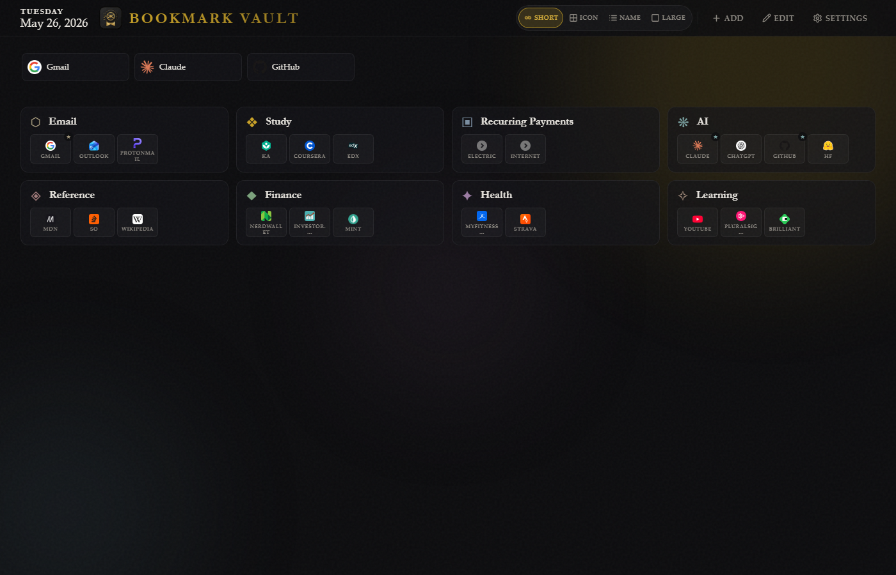

<div align="center">
  

  <h1>Bookmark Vault</h1>

  <p><em>A self-contained browser start page that lives in a single HTML file.</em></p>

  <p>No build step. No npm. No server. No account. Open the file — get your bookmarks.</p>
</div>

<p align="center">
  
</p>

---

## What it is

Bookmark Vault is a personal start page packaged as **one self-contained HTML file** (~120 KB). Double-click it, set it as your browser's new-tab page, and you have a curated dashboard of collections and bookmarks. No extension. No installer. Nothing phones home except favicon fetches.

Everything you add stays in your browser's `localStorage` on this machine.

## Features

- **Collections** with a custom icon (curated 20-glyph set verified to render monochrome cross-platform), accent color, and description
- **Bookmarks** organized per collection, with favorite-pinning to a top strip
- **Four preview modes** for collection contents: short abbreviation, icon only, icon-with-name, large icon (optionally with names underneath)
- **Open All** — launches every bookmark in a collection at once, with an optional confirmation, a max-tabs limit, and staggered opening to dodge popup blockers
- **Settings** — accent color, behavior toggles, JSON export / import, reset to defaults
- **Favicon fallback** — when a favicon can't be loaded, a deterministic colored-letter SVG avatar is drawn instead (hash of the domain → 12-color muted-jewel palette, white letter)
- **Accessible** — keyboard navigation, modal focus management + trap, ARIA labels, friendly color names, `prefers-reduced-motion` respect

## Quick start

- **Live version:** open [jedibobby.github.io/claude-bookmark-startpage](https://jedibobby.github.io/claude-bookmark-startpage/) and set it as your browser's new-tab page.
- **Local copy:** download [`index.html`](index.html), double-click to open, *(optional)* set as your new-tab / home page.

That's it.

## Customizing your page

- **+ Add** (top right): create a new collection
- **Edit** (top right): turn the home grid into clickable cards — click a collection card to enter inline edit mode for that collection
- Inside a collection: **+ Add Bookmark**, edit any existing bookmark, toggle the star to pin to favorites, drag-free reordering via add/edit
- **Settings** (top right): accent color, "show names under large icons" toggle, confirm-before-opening-all, max tabs, staggered opening, export / import, reset

## Project layout

```
index.html    — The whole app: HTML + CSS + JS, all inlined
BVicon.svg    — Design source for the emblem (the runtime copy lives inside index.html)
README.md
LICENSE
.nojekyll     — Tells GitHub Pages to skip Jekyll processing
```

## Technical notes

- **Single self-contained file.** Open via `file://` or serve over HTTP — both work
- **No build, no bundler, no npm.** Edit the file, refresh the page
- **Fonts** fall back to nice system serifs (Iowan Old Style, Palatino, Baskerville, Hoefler Text, Didot…) before Georgia. Nothing is loaded over the network
- **State** lives in `localStorage` under four keys: `startpage:groups`, `startpage:bookmarks`, `startpage:settings`, `startpage:view`
- **Favicons** are fetched from DuckDuckGo at `https://icons.duckduckgo.com/ip3/<domain>.ico`. The fallback avatar fires on actual network failures (offline / DNS / blocked)
- **Browser support.** Tested on recent Firefox, Chrome, Brave, Edge, and Safari (macOS + iOS). Uses modern CSS (`color-mix`, `inert`); older browsers miss the polish but core functionality works

## Data & privacy

- All your data stays in this browser, on this machine
- No analytics, no telemetry, no remote sync
- The only outbound network call is the favicon request to DuckDuckGo, one per visible bookmark
- Use **Settings → Data → Export** to download a JSON snapshot at any time

## Import format

```json
{
  "groups": [
    { "id": "1", "name": "My Group", "description": "...",
      "icon": "◆", "accentColor": "#c9a227" }
  ],
  "bookmarks": [
    { "id": "b1", "title": "Example", "url": "https://example.com/",
      "isFavorite": false, "groupId": "1" }
  ]
}
```

Imports are validated: each group needs an `id` and a `name`; each bookmark needs `id`, `title`, `url`, and a `groupId` that matches an imported group. Invalid items are skipped and the count is reported in a toast.

## License

[MIT](LICENSE) — do whatever you want, just keep the notice.
